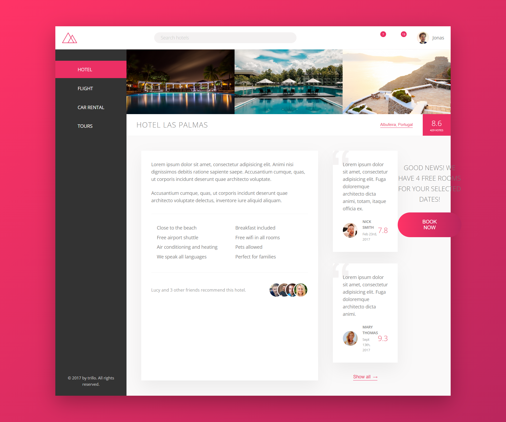

# Course Material for my Advanced CSS Course

The course [Advanced CSS and Sass](https://www.udemy.com/course/advanced-css-and-sass/) is the most advanced and modern CSS course on the internet: master flexbox, CSS Grid, responsive design, and so much more.
What I learned:

- Tons of modern CSS techniques to create stunning designs and effects
- Advanced CSS animations with @keyframes, animation and transition
- How CSS works behind the scenes: the cascade, specificity, inheritance, etc.
- CSS architecture: component-based design, BEM, writing reusable code, etc.
- Flexbox layouts: build a huge real-world project with flexbox
- CSS Grid layouts: build a huge real-world project with CSS Grid
- Using Sass in real-world projects: global variables, architecting CSS, managing media queries, etc.
- Advanced responsive design: media queries, mobile-first vs desktop-first, em vs rem units, etc.
- Responsive images in HTML and CSS for faster pageloads
- SVG images and videos in HTML and CSS: build a background video effect
- The NPM ecosystem: development workflows and building processes
- Get friendly and fast support in the course Q&A

# Natours

# Nexter

# Trillo

